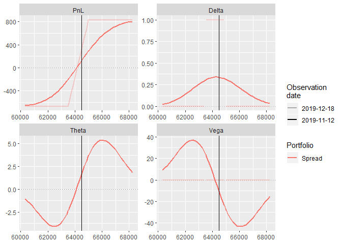
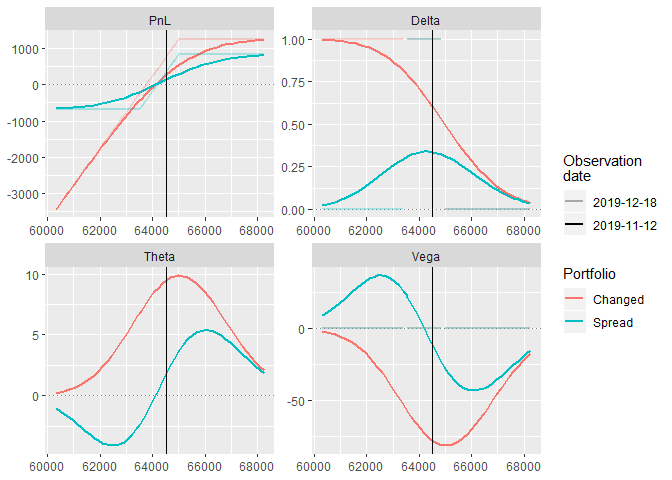

PositiveDelta
================

PositiveDelta - это модель данных и набор функций для анализа портфелей
биржевых опционов. Механизм позволяет стоить профили портфелей,
сравнивать несколько портфелей, расчитывать сценарии для разных
дат и изменения волатильности.

Пользователь может загрузить портфели и рыночные данные из любого
доступного источника (база данных, сайт биржи, торговый терминал
и т.д.). Для анализа данные должны иметь определённую структуру.

Структура данных (исходных и расчётных) определена в объектах:

  - `OptMarket` - рыночные котировки;

  - `OptPort` - портфель опционов;

  - `OptProfile` - профиль портфеля.

# Исходные данные

## Котировки OptMarket

В объект класса `OptMarket` загружаются биржевые котировки опционов,
базисного актива, текущая дата, стоимость денег. Без рыночных цен
портфель переоценивается только по его внутренней стоимости.

Структура абъекта `OptMarket`:

  - `board` - доска опционов, минимально необходимые поля - ticker,
    price;

  - `ul` - тикер базисного актива;

  - `ul_price` - цена базисного актива;

  - `now` - текущая дата.

<!-- end list -->

``` r
# Указываем тикер базисного актива
ul = 'SiZ9'

# Загружаем биржевые котировки (доску опционов)
brd  = GetBoard_fortsdb(ul)

# Создаём объект класса OptMarket
mrkt = OptMarket(ul = ul, 
                 ul_price = brd$ul_price, 
                 board = as.tbl(brd$board), 
                 now   = as.Date('2019-11-12'))
mrkt
```

    ## $ul
    ## [1] "SiZ9"
    ## 
    ## $ul_price
    ## [1] 64511
    ## 
    ## $now
    ## [1] "2019-11-12"
    ## 
    ## $board
    ## # A tibble: 555 x 12
    ##    ticker classcode ul    xtype strike expdate    iv.theor price.ask price.bid price.theor
    ##    <chr>  <chr>     <chr> <chr>  <dbl> <date>        <dbl>     <dbl>     <dbl>       <dbl>
    ##  1 SiZ9   SPBFUT    Si    f         NA 2019-12-18   NA         64511     64509       64511
    ##  2 Si520~ SPBOPT    SiZ9  c      52000 2019-12-18    0.241         0         0       12492
    ##  3 Si520~ SPBOPT    SiZ9  p      52000 2019-12-18    0.241         0         0           3
    ##  4 Si522~ SPBOPT    SiZ9  c      52250 2019-12-18    0.238         0         0       12242
    ##  5 Si522~ SPBOPT    SiZ9  p      52250 2019-12-18    0.238         0         0           3
    ##  6 Si525~ SPBOPT    SiZ9  c      52500 2019-12-18    0.235         0         0       11992
    ##  7 Si525~ SPBOPT    SiZ9  p      52500 2019-12-18    0.235         0         0           3
    ##  8 Si527~ SPBOPT    SiZ9  c      52750 2019-12-18    0.231         0         0       11742
    ##  9 Si527~ SPBOPT    SiZ9  p      52750 2019-12-18    0.231         0         0           3
    ## 10 Si530~ SPBOPT    SiZ9  c      53000 2019-12-18    0.228         0         0       11493
    ## # ... with 545 more rows, and 2 more variables: price.last <dbl>, oi <dbl>
    ## 
    ## attr(,"class")
    ## [1] "OptMarket"

## Портфель OptPort

Портфель может состоять из опционов и базисного актива. Конструктор
создаёт портфель на основе сделок (`trades`) по заданному базовому
активу (underlying - `ul`). Сделки суммируются в общую позицию
(`position`).

``` r
# Загружаем сделки из базы данных (в базу сделки импортированы из терминала QUIK)
trades = GetTrades_fortsdb()

# Забираем параметры опционов из доски опционов
trades = TickerToParams_fortsboard(trades, mrkt$board)

trades
```

    ##       ticker   ul xtype strike    expdate tradeprice amount  q
    ## 1 Si63500BX9 SiZ9     p  63500 2019-12-18        417    417  1
    ## 2 Si65000BL9 SiZ9     c  65000 2019-12-18        401    401 -1
    ## 3       SiZ9   Si     f     NA 2019-12-18      64153  64153  1

На основании сделок создаём объект `OptPort`:

  - `ul` - тикер базисного актива (обязательно)

  - `trades` - таблица сделок с обязательными полями `ticker`, `xtype`,
    `strike`, `expdate`, `tradeprice`, `q` ;

  - `sum_trades` - сальдировать сделки (только уникальные контракты в
    позиции) или добавить в позицию как есть;

  - `name` - имя портфеля (опционально, нужно для идентификации портфеля
    в случае сравнения нескольких)

<!-- end list -->

``` r
port = OptPort(ul = ul, 
               trades = trades, 
               sum_trades = T, 
               name = 'Spread')

port
```

    $name
    [1] "Spread"
    
    $ul
    [1] "SiZ9"
    
    $position
          ticker   ul xtype strike    expdate  q tradeprice amount pl
    1 Si63500BX9 SiZ9     p  63500 2019-12-18  1        417   -417 NA
    2 Si65000BL9 SiZ9     c  65000 2019-12-18 -1        401    401 NA
    3       SiZ9   Si     f     NA 2019-12-18  1      64153 -64153 NA
    
    $trades
          ticker   ul xtype strike    expdate tradeprice amount  q
    1 Si63500BX9 SiZ9     p  63500 2019-12-18        417    417  1
    2 Si65000BL9 SiZ9     c  65000 2019-12-18        401    401 -1
    3       SiZ9   Si     f     NA 2019-12-18      64153  64153  1
    
    attr(,"class")
    [1] "OptPort"

Ключевое поле после создания объекта - `position`. Это, собственно, и
есть портфель - текущая позиция в опционах и базисном активе.

# Анализ портфеля

## Оценка портфеля

Функция `PortPricing` применяет рыночные котировки на портфель, т.е.
переоценивает его по текущим ценам. Если известны цены опционов,
функция расчитывает ожидаемую волатильность опционов. Если
переоценка по волатильности - рассчитываются цены.

`price_at` - тип цены для переоценки портфеля. Это префикс названия
колонок цены или волатильности в `OptMarket$board`.

``` r
port = PortPricing(port, mrkt, price_at = 'theor')

port$position
```

    ##       ticker   ul xtype strike    expdate  q tradeprice amount price tilexp     iv
    ## 1 Si63500BX9 SiZ9     p  63500 2019-12-18  1        417   -417   278     36 0.0829
    ## 2 Si65000BL9 SiZ9     c  65000 2019-12-18 -1        401    401   489     36 0.0871
    ## 3       SiZ9   Si     f     NA 2019-12-18  1      64153 -64153 64511     36 0.0000

## Прибыль и “греки”

Функция `PortValuation` расчитывает параменты портфеля по текущим ценам.
Результаты сохраняются в поле `total_value` объекта `OptPort`.

``` r
port = PortValuation(port)

port$total_value
```

    ##   ticker     pl  delta     gamma theta   vega
    ## 1  Total 131.11 0.3358 -2.24e-05 1.767 -11.39

## Профиль портфеля - OptProfile

Профиль портфеля опционов - основной инструмент анализа. В классическом
варинате, он отражает зависимость прибыли и “греков” портфеля от цены
базисного актива.

Объект `OptProfile` содержит профиль портфеля на интервале цен базисного
актива. Интервал (`ul_range`) - процентное отклонение от максимального и
минимального страйков портфеля.

Функция `PlotProfile` строит график профиля на базе `ggplot2`.

``` r
myprofile = OptProfile(optport  = port, 
                       params   = c('pl', 'delta', 'theta', 'vega'), 
                       ul_range = 0.05) 

PlotProfile(myprofile)
```



# Анализ сценариев

Механизм позволяет вносить изменения в портфель, сравнивать несколько
портфелей с одним базисным активом, а также использовать сценарии
What-if для разных сроков до погашения или изменения волательности.

## Манипуляции с портфелем

Новые сделки можно добавлять в портфель функцией AddTrades:

  - `port` - портфель (объект `OptPort`), в которые добавить сделку;

  - `trades` - dataframe со сделками;

  - `sum_trades` - расчитывать чистую позицию из сделок; если `FALSE` -
    новая сделка появится в позиции отдельной
строкой.

<!-- end list -->

``` r
newtrade = data.frame(ul='SiZ9', ticker='Si63500BX9', xtype='p', strike=63500, 
                      expdate=as.Date('2019-12-19'), tradeprice=500, q=-1 )

port2 = AddTrades(port = port, 
                  trades = newtrade, 
                  sum_trades = T)

port2$name = 'Changed'
```

Профиль нового портфеля можно сравнить со старым. Функция `JoinProfiles`
объединяет данные профилей для построения общего графика. Первый профиль
в списке -
приоритетный.

``` r
port2 = port2 %>% PortPricing(., mrkt, price_at = 'theor') %>% PortValuation(.)

myprofile2 = OptProfile(optport  = port2, params = c('pl', 'delta','theta', 'vega'), ul_range = 0.05) 

profiles = JoinProfiles(list(myprofile, myprofile2))

PlotProfile(profiles)
```


